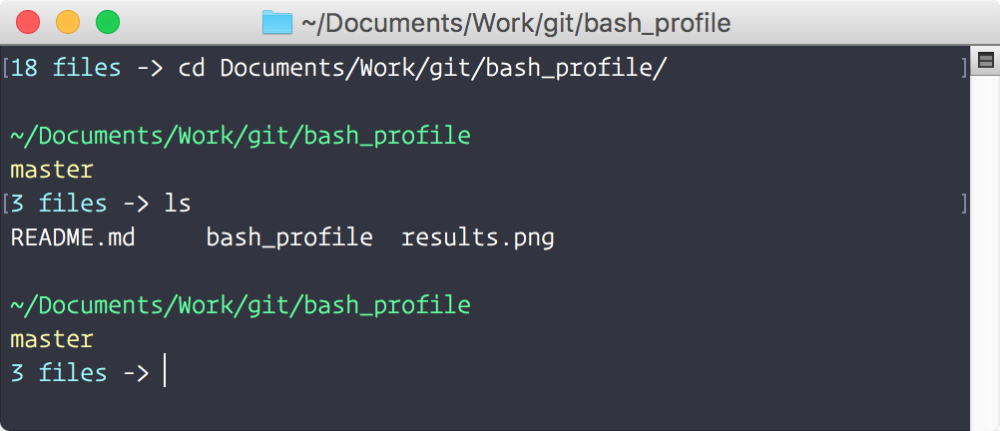

# bash_profile
My favorite bash profile
```bash
export PS1="\n\[\033[32m\]\w\n\[\033[1;36m\]\$(ls -1 | wc -l | sed 's: ::g') files\[\033[0m\] -> \[\033[0m\]"
export LSCOLORS=ExFxBxDxCxegedabagacad
alias ls='ls -GFh'
```
Result:


I am using the terminal theme from 
* [@zenorocha](https://github.com/zenorocha/dracula-theme) - Dracula - Theme
